### Original and histogram

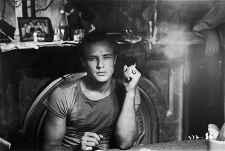 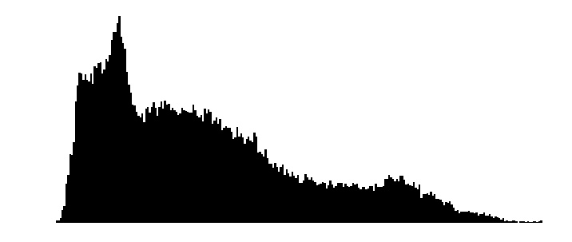

### Original and negative

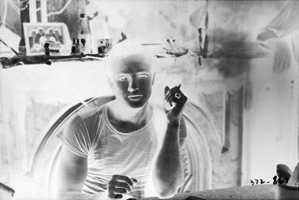

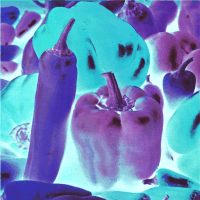

### Original and thresholded image

 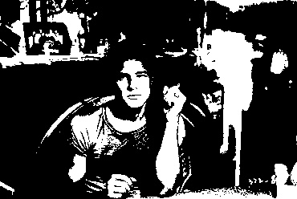

 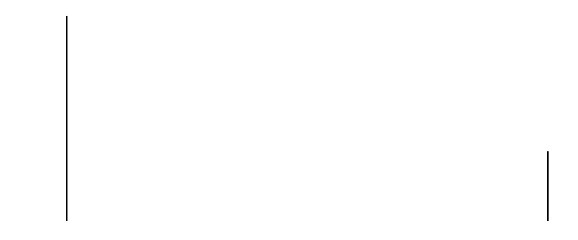

### Original and brightness change</h3>

 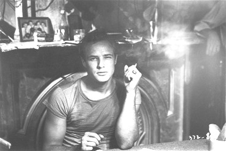 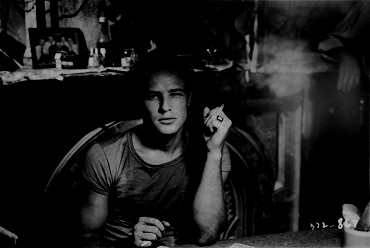

 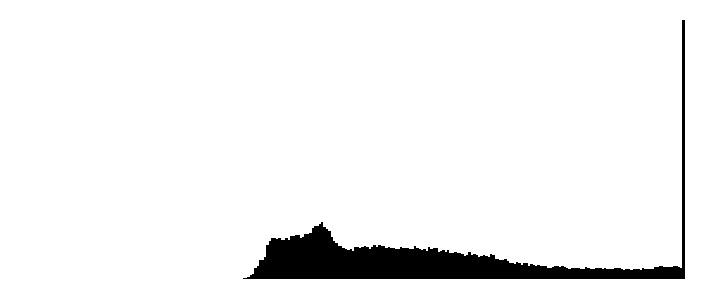 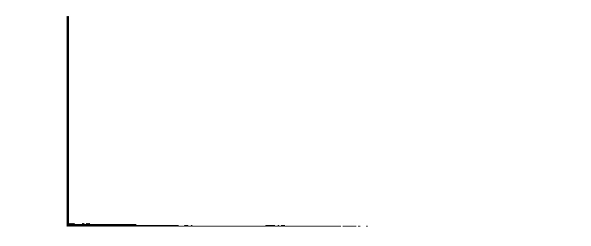

 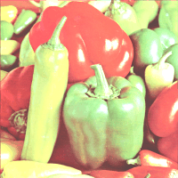 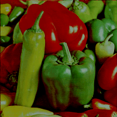

### Original and contrast change

 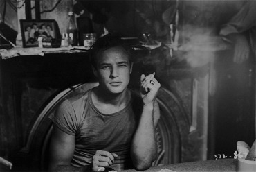 

 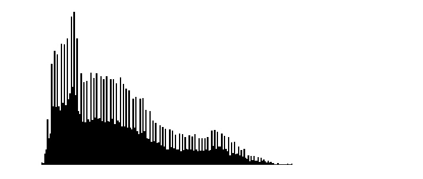 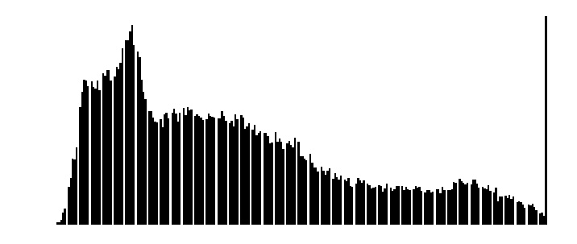

### Original and gamma correction
 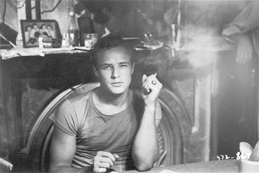 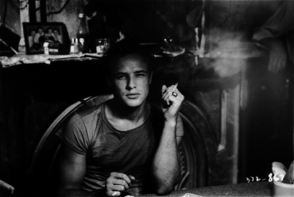

 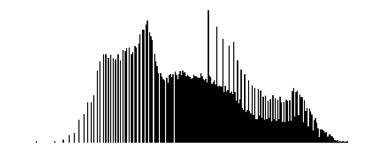 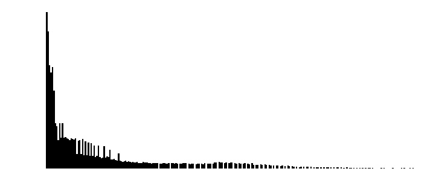

### Original and non-linear contrast change

 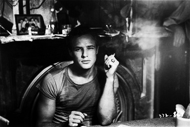 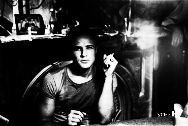

 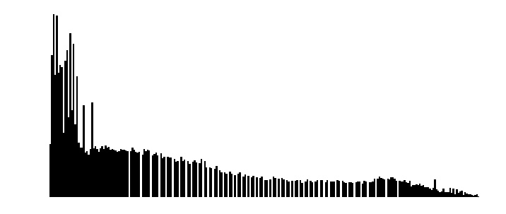 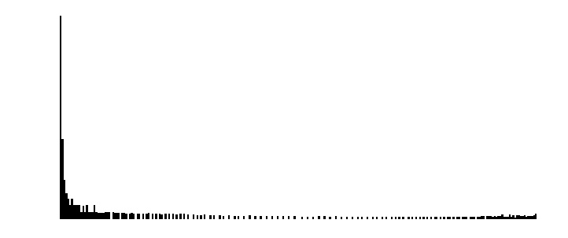

### Original and histogram equalization

 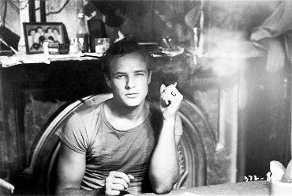

 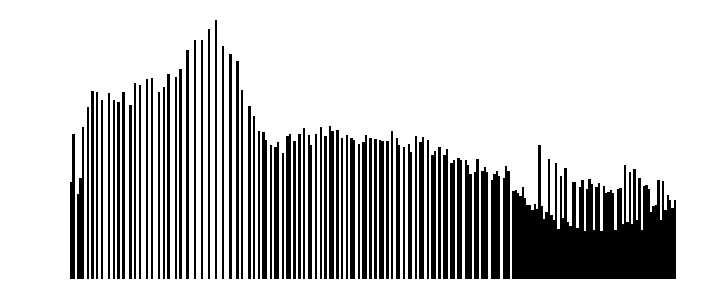

