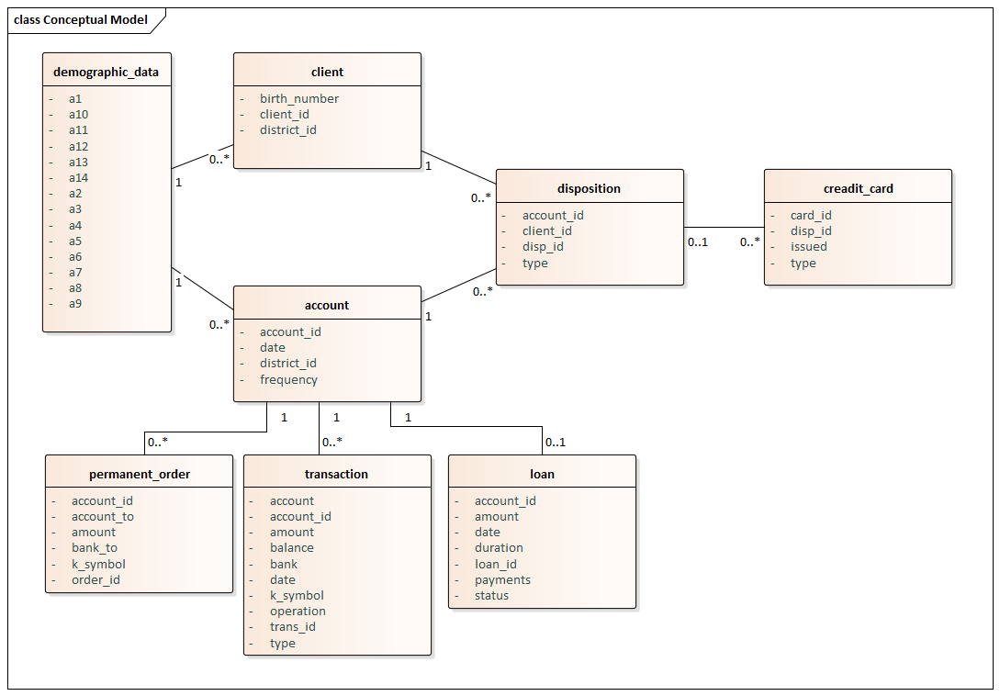
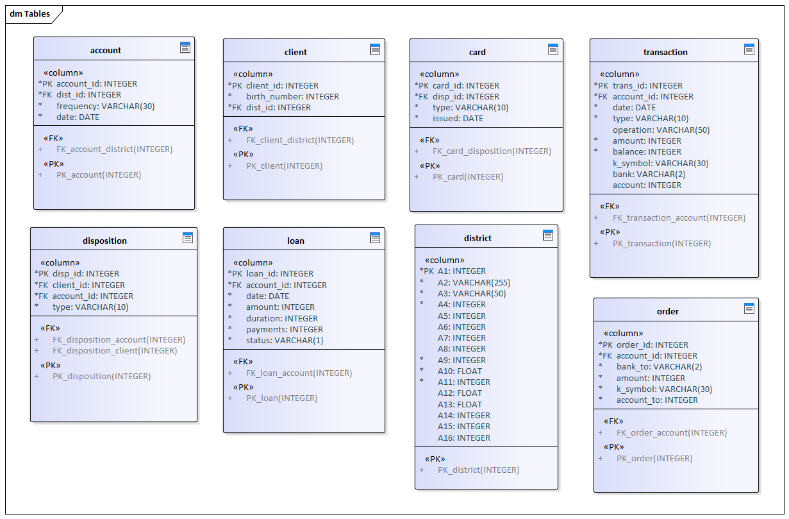
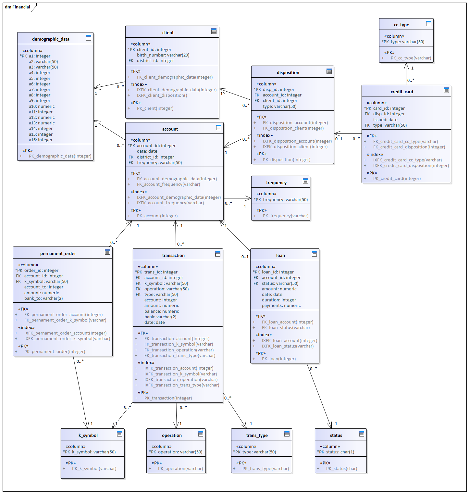

# 01 Data Analysis

### Data Description
The data package Financial contains customer data of an unknown bank. The bank stores data of their customers and their accounts as well as other additional services such as credit cards and loans
We acquired these following ASC files:
account – bank account characteristics
* card – credit card information
* client – client description
* disp – disposition information (operational rights of clients)
* district – branch’s district information
* loan – loan information issued for a given account
* order – records of payment orders
* trans – records of transactions on an account

From these files, we’ll be able to uncover dependencies between several entities and possibly find the relationship between:
1.	demographic information and high-risk debtors.
2.	transaction data and high-risk debtors

#### Account data, 4,500 objects
* **account_id:** unique ID of the account; int
* **district_id:** ID of the banking branch (indicates district); int
* **frequency:** frequency of issuing account statement, {POPLATEK MESICNE, POPLATEK TYDNE, POPLATEK PO OBRATU}; string
* **date:** date of account creation in format YYMMDD; date

#### Card data, 892 objects
* **card_id:** unique card ID; int
* **disp_id:** ID of disposition; int
* **type:** card type, {classic, junior, gold}; string
* **issued:** card issue date in format YYMMDD (with redundant zeros indicating time); date

#### Client data, 5,369 objects
* **client_id:** unique client ID; int
* **birth_number:** (non-unique) birth number - YYMMDD for men, YYMMDD+50 for women; int
* **district_id:** ID of district where client resides; id

#### Disposition data, 5,369 objects (1 for each client)
* **disp_id:** unique record ID; int
* **client_id:** unique client ID; int
* **account_id:** non-unique account ID; int
* **type:** type of disposition {OWNER, DISPONENT}, constraint: only owner can issue permanent order or ask for a loan; there is 4500 owners - 1 for each account, 869 accounts have a second disponent; string

#### District data, 77 objects 
* **A1:** unique district ID; int
* **A2:** district name; string
* **A3:** region {8 values}; string
* **A4:** # of inhabitants; int
* **A5:**  # of municipalities with inhabitants < 499; int
* **A6:**  # of municipalities with inhabitants between 500 and 1,999; int
* **A7:**  # of municipalities with inhabitants between 2,000 and 9,999; int
* **A8:**  # of municipalities with inhabitants > 10,000; int
* **A9:**  # of cities; int
* **A10:**  ratio of urban inhabitants; float
* **A11:**  average salary; int
* **A12:**  unemployment rate in the year 1995; float
* **A13:**  unemployment rate in the year 1996; float
* **A14:**  # of entrepreneurs per 1,000 inhabitants; int
* **A15:**  # of committed crimes in 1995; int
* **A16:**  # of committed crimes in 1996; int

#### Loan data, 682 objects 
* **loan_id:** unique record ID; int
* **account_id:** unique account ID; int
* **date:** date when loan was granted; date
* **amount:** amount of money; int
* **duration:** duration of the loan in moths, 1-5 years; int
* **payments:** amount of money paid monthly; int
* **status:** loan status, {A – finished with no problems, B – finished unpaid, C – still running without problems, D – still running with client in debt}; string

#### Order data, 6,471 objects 
* **order_id:** unique record ID; int
* **account_id:** account ID for which the order is issued for; int
* **bank_to:** 2 letter code indicating bank of the recipient; string
* **account_to:** account number of the recipient; int
* **amount:** amount of money; int
* **k_symbol:** type of payment {POJISTNE, SIPO, LEASING, UVER, OTHER}, OTHER is not indicated in data but is left empty; string

#### Transaction data, 1,056,320 objects 
* **trans_id:** unique record ID; int
* **account_id:** account ID; int
* **date:** date of transaction in format YYMMDD; date
* **type:** indicator if transaction is incoming or outgoing, {PRIJEM, VYDAJ, VYBER}, VYBER isn’t indicated in documentation and should be probably in category VYDAJ; string
* **operation:** mode of transaction, {VYBER, PREVOD NA UCET, VKLAD, PREVOD Z UCTU, VYBER KARTOU}
* **amount:** amount of money; int
* **balance:** account balance after transaction; int
* **k_symbol:** type of payment {UROK, SLUZBY, SIPO DUCHOD, POJISTNE, UVER, SANKC. UROK, OTHER}, OTHER is not indicated in data but is left empty; string
* **bank:** 2 letter code of the partner bank; string
* **account:** partner’s account number; int

### Entity model:

### Stage database model:

### Target database model:

